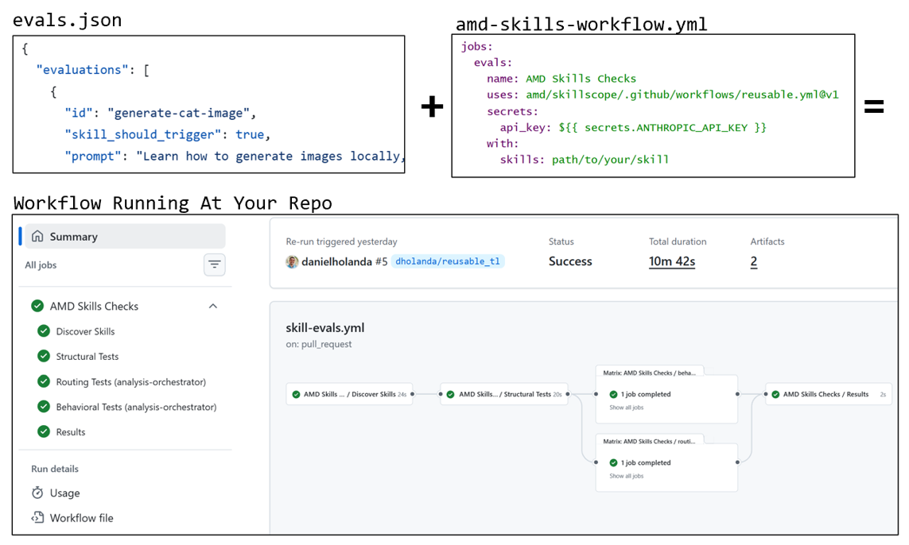

<!--
Copyright Advanced Micro Devices, Inc.

SPDX-License-Identifier: MIT
-->

# Skillscope


[](https://www.anthropic.com/claude-code)
[](.github/workflows/reusable.yml)
[](LICENSE)


A test harness for AI agent skills. Install the harness, or point a workflow at your repo. Skillscope enables three main types of tests:

* **Structural**: Checks whether the skill is well structured (contains the expected files, a proper hierarchy, etc.).
* **Routing**: Checks whether the skill triggers when it should and stays quiet when it shouldn't. You may also point to more than one skill here to explore how skills interfere with each other's routing.
* **Behavioral**: Runs the agent end to end and uses an LLM judge to confirm the skill behaves correctly.

All three read one dataset per skill, `<skill>/evals/evals.json`. How to write one is in [docs/authoring-evals.md](docs/authoring-evals.md).

> [!IMPORTANT]
> **Early Days**: Flags, workflow inputs, and report formats may evolve quickly as this repo takes shape.

## Quick start

Run from the root of the repo you want tested.

```bash
uv tool install --system-certs git+https://github.com/amd/skillscope

skillscope structural                        # no agent, no tokens
skillscope structural --external             # the same, plus checking external URLs
skillscope behavioral --skill my-skill       # needs an authenticated `claude` CLI
skillscope routing --routing-room my-skill,its-neighbour  # also needs a key in the environment
```

`routing` needs `ANTHROPIC_API_KEY` or `ANTHROPIC_AUTH_TOKEN` set, and refuses
to start without one — a `claude login` on its own is not enough. The key is
what lets the run point the CLI at its own config directory; without that, the
runner's own `~/.claude/skills` join the room for every case and the scores
describe a room nobody asked for. `behavioral` installs one skill and grades
what the agent produced, so a stray skill is at worst noise there, and a plain
`claude login` is fine.

## Run it from your CI

Simply add an `evals.json` file to your skill and a workflow that points to our reusable workflow. This will triger all graders to run directly from your repo.



```yaml
jobs:
  evals:
    uses: amd/skillscope/.github/workflows/reusable.yml@v0.1.3
    secrets:
      api_key: ${{ secrets.ANTHROPIC_API_KEY }}
    with:
      skills: skills/*
```

You may also choose to customize or even disable some tests if you prefer it. See [docs/usage.md](docs/usage.md) for details.

## Commands

| Command | Does |
| --- | --- |
| `skillscope structural` | Skill folders, datasets, and markdown references. |
| `skillscope routing` | Which skill fires, with several installed together. |
| `skillscope behavioral` | What a skill does once it has fired. |
| `skillscope select` | The CI plan for a change, as JSON. |
| `skillscope list-skills` | The skills that have a dataset, as JSON. |
| `skillscope template` | The dataset template a new skill starts from. |

`--help` on any of them is the reference. Reports go to stdout as markdown, to
`$GITHUB_STEP_SUMMARY` under Actions, and to JSON under `.skillscope/runs/` in
the repo under test — worth adding to `.gitignore`.

## Docs

* [docs/authoring-evals.md](docs/authoring-evals.md): writing a skill's tests.
* [docs/usage.md](docs/usage.md): every flag, every workflow input, and what
  each check actually asserts.

## Development

```bash
python -m pip install -e .
python -m unittest discover -s tests -t .
```

Runtime dependencies are PyYAML for frontmatter, `inspect-ai` for the eval
framework both engines are built on, and `anthropic` for the model client.
`inspect-ai` became required when the last stdlib-only engine was removed; the
test suite still runs on the standard library alone, and builds a throwaway
repo in a temp directory rather than reading the tree it runs in.

## License

MIT. See [LICENSE](LICENSE).
